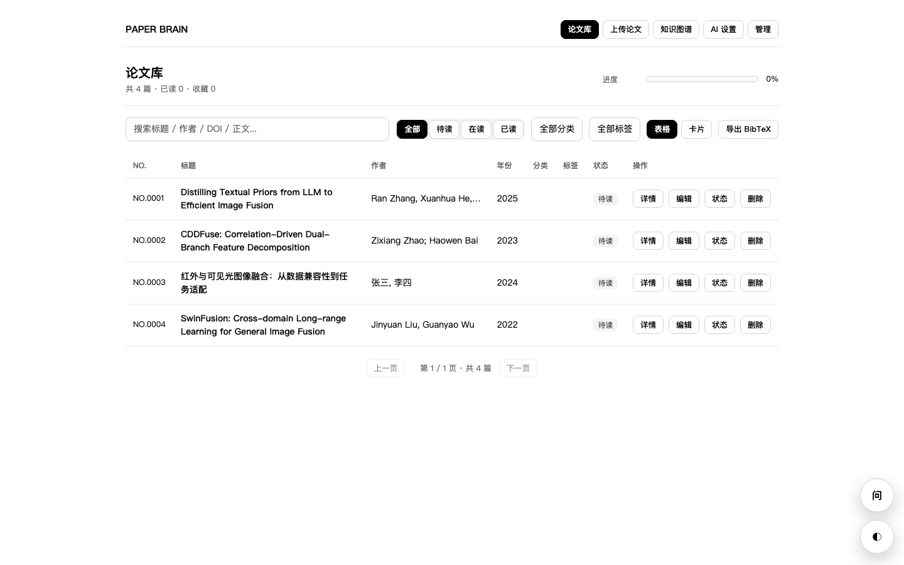
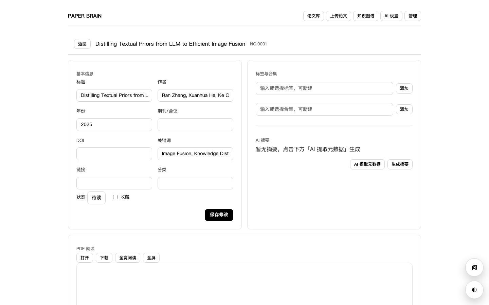
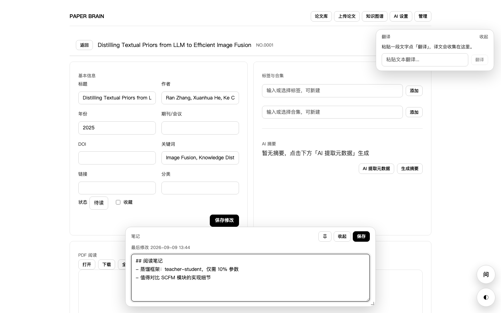
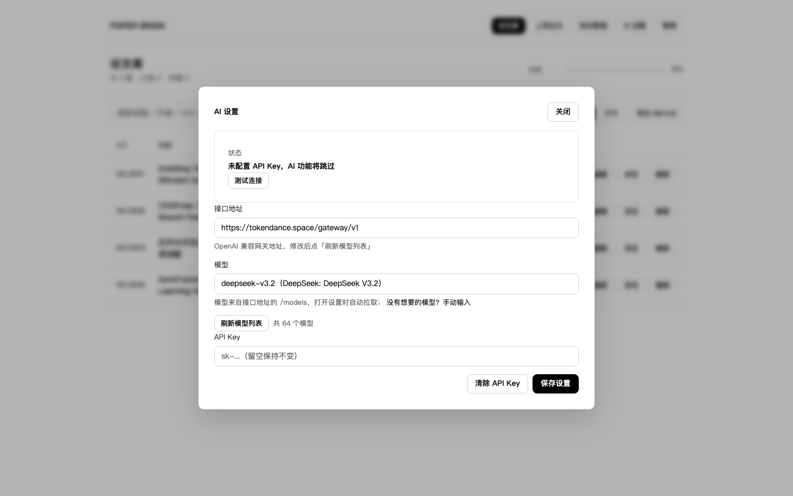
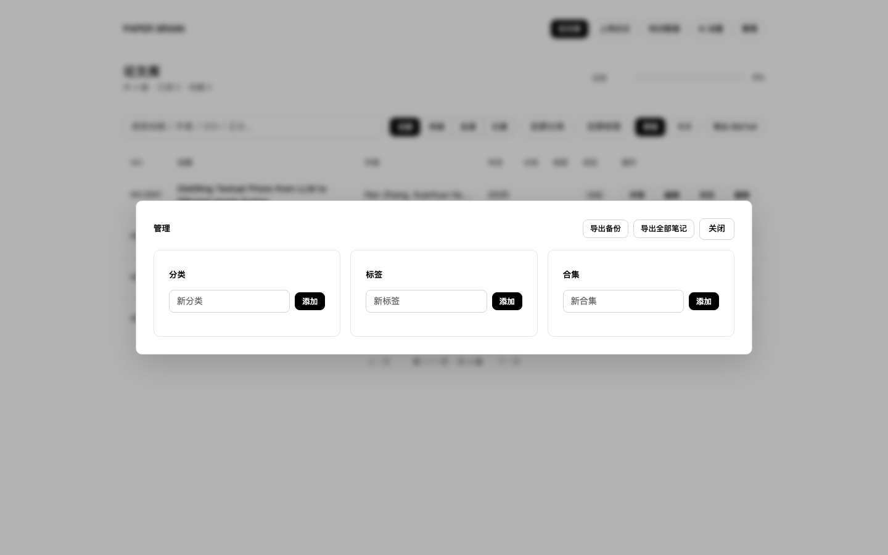
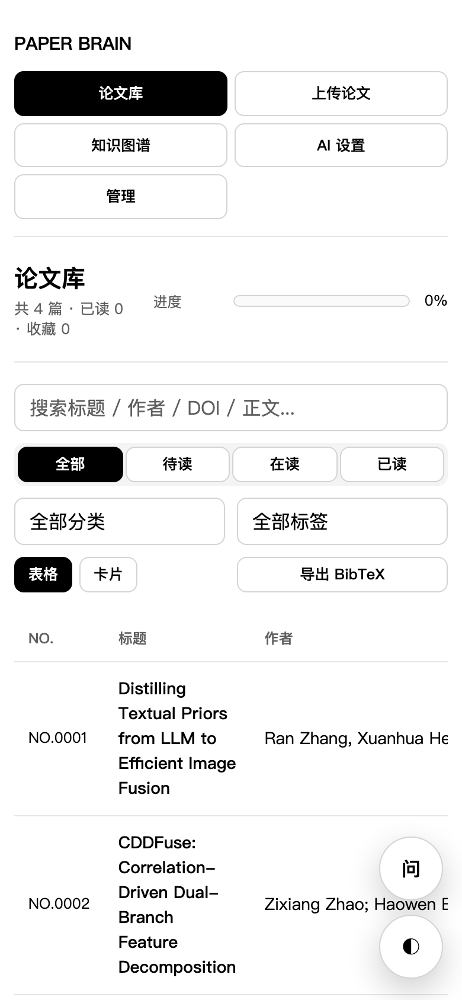

# Paper Manager 论文管理系统

[](https://github.com/UndertaK33r/paper-manager/actions/workflows/ci.yml)
[](https://github.com/UndertaK33r/paper-manager/releases)
[](LICENSE)


**本地优先的个人论文库**：上传 PDF 自动提取元数据与全文，支持分类/标签/合集、全文搜索、笔记、AI 总结与问答。
单二进制分发（前端已内嵌），数据全在自己机器上，不依赖任何云服务。



<table>
<tr>
<td width="50%"><br><sub>详情：原生 PDF 阅读 + 笔记</sub></td>
<td width="50%"><br><sub>全屏阅读：笔记浮窗可拖动 / 调大小 / 固定</sub></td>
</tr>
<tr>
<td><br><sub>AI 设置：模型列表从网关实时拉取</sub></td>
<td><br><sub>管理：分类 / 标签 / 合集，一键导出备份</sub></td>
</tr>
</table>

<p align="center"><br><sub>移动端可用</sub></p>

## 功能

- **收录**：拖拽 PDF 自动提取标题 / 作者 / 年份 / 期刊 / DOI / 关键词 / 全文（支持中文 PDF），可选 AI 补充提取
- **补全**：按 DOI 走 Crossref、OpenAlex；按标题走 arXiv、Crossref 检索
- **阅读**：两种视图随时切换 —— **PDF 原文**（浏览器原生）与 **阅读模式**（把已提取的全文重排成可读正文：按页分隔、合并硬换行、还原英文断词与 PDF 首字母下沉、识别小节标题、弱化页眉页脚；进入全屏自动切换）
- **标注**：在阅读模式里选中文字即可高亮（黄/绿/蓝/粉四色），可写备注、改色、删除；标注随论文保存、刷新后按偏移精确复原；详情页有标注列表（点一下定位到正文），可一键按 Markdown 插入笔记
- **笔记浮窗**：可拖动、可调长宽、图钉固定（位置与尺寸本地持久化）
- **笔记**：支持 **Markdown 渲染预览**（标题/列表/表格/代码/引用），编辑与预览一键切换；停止输入自动保存，乐观锁避免多窗口互相覆盖；可导出为 Markdown
- **组织**：分类 / 标签 / 合集 / 阅读状态 / 收藏；搜索（含全文）、筛选、排序、分页
- **回收站**：删除先进回收站（PDF 与关联保留），可恢复或彻底删除；不再一删就没了
- **AI**：总结、元数据提取、粘贴文本翻译、问论文库（RAG）；模型列表从网关 `/models` 实时拉取
- **导出与备份**：BibTeX、全部笔记 Markdown、**一键备份 zip（数据库一致性快照 + 全部 PDF）**
- **引用图谱**：基于参考文献关系构图（带缓存）
- **三套主题**（日间 / 黑夜 / 护眼）、移动端自适应、可选密码保护

## 快速开始

### 方式一：免安装（推荐个人使用）

```bash
curl -fsSL https://github.com/UndertaK33r/paper-manager/releases/latest/download/install.sh | bash
```

或到 [Releases](https://github.com/UndertaK33r/paper-manager/releases) 下载对应系统的压缩包，解压后直接运行。
程序会在**自身所在目录**旁创建 `data/`，数据跟着程序走，换机器把 `data/` 一起拷走即可。

> macOS 若提示「已损坏 / 无法验证开发者」：打开 系统设置 → 隐私与安全性 → 底部点「仍要打开」，
> 或终端执行 `xattr -cr <程序文件>`（详见压缩包内 `使用说明.txt`）。

### 方式二：Docker（集中部署，实验室共享）

```bash
docker compose up -d --build
# 访问 http://<机器IP>:8080
```

### 方式三：源码运行

```bash
go run ./cmd/server        # 需要 Go 1.24+，访问 http://localhost:8080
./build.sh                 # 构建四平台免安装包到 dist/
```

国内网络建议 `export GOPROXY=https://goproxy.cn,direct`。

## 数据与备份

数据只有两处：`data/paper-manager.db`（SQLite）和 `data/uploads/`（PDF 原件）。

- **一键备份**：管理弹窗 → 「导出备份」，下载的 zip 内含导出时刻的**一致性数据库快照**（`VACUUM INTO`，包含 WAL 中未落盘的事务）、全部 PDF 与恢复说明
- **恢复**：退出程序 → 把 zip 里的 `data/` 解压覆盖到程序旁 → 重启
- **误删兜底**：删除是软删除，进「管理 → 回收站」可恢复；彻底删除与清空回收站才会删掉 PDF 文件
- 数据库为 WAL 模式，写入有事务保证；笔记使用乐观锁（`notes_updated_at`），并发修改返回 409 而不是静默覆盖

## 密码保护

设置 `AUTH_USERNAME` / `AUTH_PASSWORD` 后：

- 静态页面（HTML/CSS/JS）**不校验**，以便加载应用内的登录页；**所有 `/api/` 请求**都需要凭据
- 支持三种凭据：HTTP Basic（浏览器原生弹窗）、`Authorization: Bearer <密码>`（应用登录页）、`?token=<密码>`（下载 / iframe 等无法自定义请求头的场景）

```bash
AUTH_USERNAME=admin AUTH_PASSWORD=yourpass HOST=127.0.0.1 go run ./cmd/server
```

未设置密码时允许局域网免密访问，启动日志会给出提示。

## AI 设置

顶栏「AI 设置」填 API Key 即可。默认地址 `https://tokendance.space/gateway/v1`，可改成任意 OpenAI 兼容接口
（如 `https://api.deepseek.com/v1`）；模型列表从网关 `/models` 拉取，也可手动输入。未配置 Key 时 AI 功能自动跳过。

安全约束：存储的 Key **只发往与配置地址严格一致的地址**，禁止跟随重定向（防 Key 泄漏），上游响应限 1MiB、
请求体限 16KiB、超时 8s，失败明确返回 `source: "unavailable"` 而不是用硬编码列表冒充。

也可用环境变量：`AI_API_KEY`、`AI_BASE_URL`、`AI_MODEL`。

## 环境变量

| 变量 | 默认值 | 说明 |
| --- | --- | --- |
| PORT | 8080 | 监听端口 |
| HOST | 空（所有网卡） | 绑定地址，`127.0.0.1` 表示仅本机 |
| DATA_DIR | 源码运行 `./data`，发布包 exe 旁 | 数据目录 |
| UPLOAD_DIR | `<DATA_DIR>/uploads` | PDF 目录 |
| WEB_DIR | 内嵌资源 | 显式指定前端静态目录（会先校验） |
| MAX_UPLOAD_MB | 100 | 上传上限 |
| AUTH_USERNAME / AUTH_PASSWORD | 空 | 可选访问密码 |
| AI_API_KEY / AI_BASE_URL / AI_MODEL | 空 | AI 配置（也可在设置页保存） |
| NO_OPEN | 空 | 设为 1 则启动时不自动打开浏览器 |

## 架构

```
浏览器 (Vue 3, 无构建步骤)
   │  /api/*
   ▼
internal/api       HTTP 层：路由、鉴权、参数校验、字段级 PATCH
   ├── internal/store   SQLite（纯 Go 驱动 modernc.org/sqlite）
   │                     · SavePaper：论文 + 标签 + 合集同一事务
   │                     · UpdateFields：字段级原子更新 + 乐观锁
   │                     · Snapshot：VACUUM INTO 一致性快照（备份）
   ├── internal/pdf     PDF 元数据与全文提取（ledongthuc/pdf）
   ├── internal/meta    DOI / 标题 → Crossref、OpenAlex、arXiv 补全
   └── internal/ai      OpenAI 兼容客户端（总结 / 提取 / 翻译 / 问答）
```

**为什么这么设计**

- **只有两个直接依赖**：`modernc.org/sqlite`（纯 Go，无 CGO）与 `ledongthuc/pdf`。因此四平台交叉编译只需一条
  `go build`，不需要 Docker、CGO 工具链或交叉编译器
- **前端零构建**：Vue 3 全局构建 + 单文件模板，资源通过 `go:embed` 内嵌进二进制。用户拿到的是一个文件，
  没有 node_modules、没有构建步骤
- **数据一致性优先**：所有会同时改动论文与关联表的操作都走事务；笔记用乐观锁而不是整行覆盖；
  元数据回写只更新自己负责的列，避免慢 AI 调用覆盖用户刚写的笔记
- **失败要显式**：上游 AI 不可用时返回 `unavailable` 与提示，而不是编造数据；备份走数据库快照而不是直接拷文件

## 测试

```bash
go test ./... && go vet ./...      # 单元测试（存储 / 鉴权 / 备份 / 模型列表 / PDF 解析）

cd e2e && npm ci && npx playwright test    # 端到端冒烟（自带隔离实例，不碰真实数据）
```

E2E 覆盖（9 例）：首页加载、上传 PDF、详情渲染、笔记自动/手动保存、笔记浮窗拖动与固定、删除、
回收站恢复与彻底删除、笔记 Markdown 预览（含注入转义）、阅读模式与标注（重排、高亮、持久化、删除）、备份接口。
CI（`.github/workflows/ci.yml`）在每次 push 与 PR 上跑这两组测试。

## API 概览

```
GET    /api/papers                        列表（搜索/筛选/排序/分页）
POST   /api/papers                        添加论文（multipart，可带 PDF；重复时返回 409）
POST   /api/papers/extract-pdf            PDF 元数据预览提取
GET/PUT/PATCH/DELETE /api/papers/{id}     详情 / 更新 / 部分更新 / 删除（进回收站）
GET    /api/trash                         回收站列表
DELETE /api/trash                         清空回收站（连同 PDF 一起删除）
POST   /api/papers/{id}/restore           从回收站恢复
DELETE /api/papers/{id}/purge             彻底删除（连同 PDF）
GET    /api/papers/{id}/pdf               获取 PDF（?download=1 下载）
GET    /api/papers/{id}/text              阅读模式的结构化全文（分页/段落/偏移）
GET    /api/papers/{id}/annotations       标注列表
POST   /api/papers/{id}/annotations       新建标注
PATCH  /api/annotations/{id}              改标注颜色/备注
DELETE /api/annotations/{id}              删除标注
POST   /api/papers/{id}/toggle-read       切换阅读状态
POST   /api/papers/{id}/re-extract        重新提取全文
POST   /api/papers/{id}/re-detect         重新识别元数据
POST   /api/papers/{id}/ai-extract        手动 AI 提取
POST   /api/papers/{id}/summarize         AI 总结
POST   /api/papers/{id}/tags[/{tagID}]    加/删标签
POST   /api/papers/{id}/collections[/{id}] 加/删合集
GET/POST/DELETE /api/categories[/{id}]    分类
GET/POST/DELETE /api/tags[/{id}]          标签
GET/POST/DELETE /api/collections[/{id}]   合集
GET    /api/stats                         统计
GET    /api/health                        健康检查（含版本号）
GET/PUT /api/settings                     AI 设置
GET/POST /api/ai/models                   模型列表（POST 可带 base / apiKey）
POST   /api/ai/test                       测试 AI 连接
POST   /api/ai/translate-text             翻译一段文本
GET    /api/papers/export.bib             导出 BibTeX
GET    /api/papers/export/notes           导出全部笔记（Markdown）
GET    /api/backup                        一键备份（zip：数据库快照 + PDF）
POST   /api/ask                           问论文库（RAG）
GET    /api/graph                         引用网络
```

## 目录结构

```
paper-manager/
├── cmd/server/        # 入口：路径解析、环境变量、启动
├── internal/
│   ├── ai/            # OpenAI 兼容客户端
│   ├── api/           # HTTP 处理器、路由、鉴权、备份
│   ├── meta/          # Crossref / OpenAlex / arXiv 元数据补全
│   ├── models/        # 数据模型
│   ├── pdf/           # PDF 元数据与全文提取 + 阅读模式重排（SplitReading）
│   └── store/         # SQLite 存储（事务、乐观锁、快照）
├── web/               # 前端（Vue 3 全局构建 + 样式，go:embed 内嵌）
├── e2e/               # Playwright 端到端冒烟测试
├── docs/screenshots/  # README 截图
├── build.sh           # 四平台免安装包
├── Dockerfile / docker-compose.yml
└── ROADMAP.md         # 后续规划与优先级
```

## License

[MIT](LICENSE)
